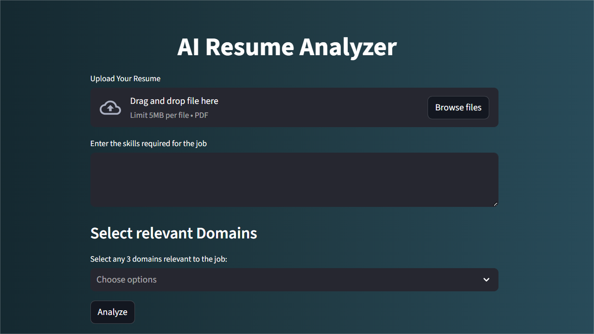
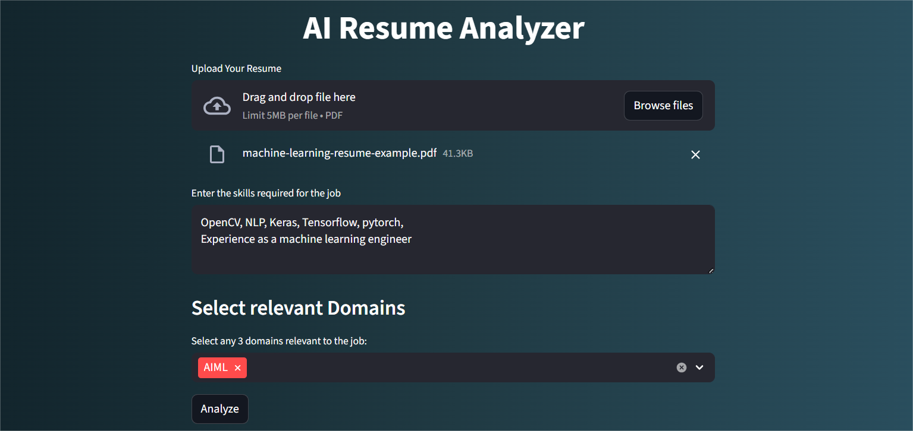
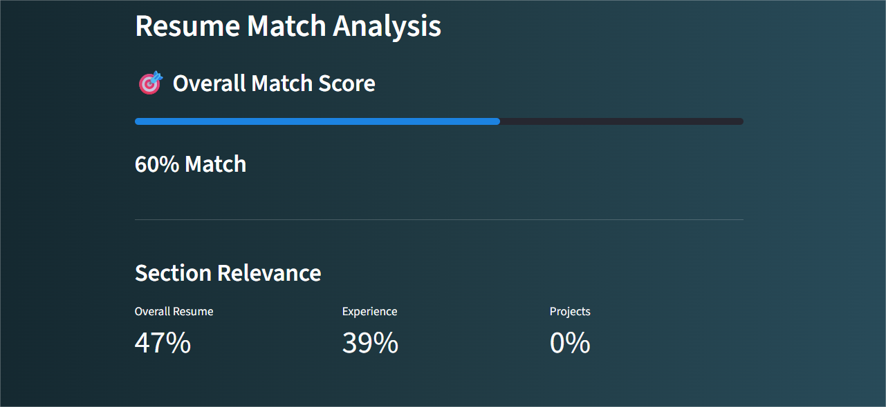
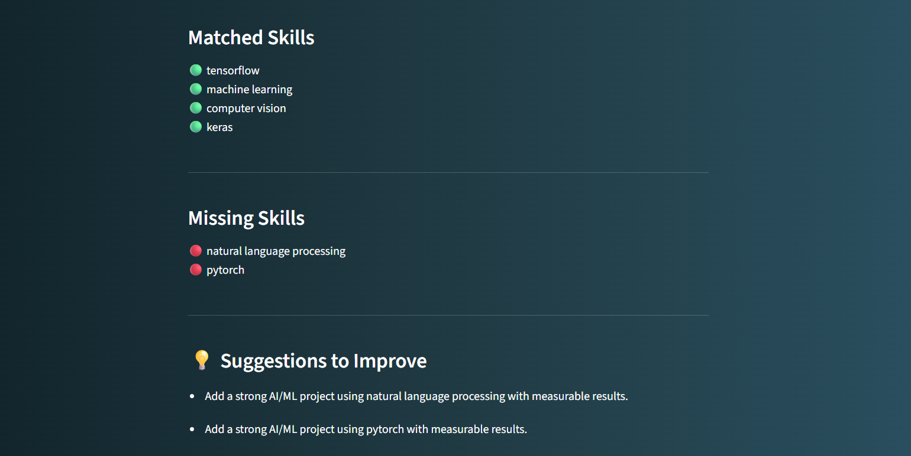

# AI Resume Analyzer 


Its an AI-powered resume analysis tool that compares a resume with job description (or) required skills for the job or internship and provides a match score, shows the missing skills in the resume.


## Features


- Upload resume in PDF Format
- Extract Skills, experience and project sections from the resume
- Compares Resume with the required skills (or) Job description
- Semantic similarity-based match score
- Detects missing Skills


## How it Works??


1. Extracts text from the uploaded resume.
2. Detects sections like:
    - Technical skills
    - Experience
    - Projects
3. Calculates:
    - Overall Semantic similarity
    - Experience relevance
    - Project relevance
4. Generates a final match score


## Tech Stack


- Python
- Streamlit (UI)
- pdfplumber (PDF text extraction)
- spaCy (NLP processing)
- Sentence Transformers (semantic similarity)


## Project Structure

```
resume-analyzer/
|
|---App.py
|---.streamlit
|---skill_synonyms.json     #synonyms of skills
|---skills_database.json    #database of skills in different domains
|---requirements.txt
|---README.md

```


## Installation (local Setup)

### 1. Clone the Repository
```bash
git clone https://github.com/Venkatasai-rohith/resume-analyzer.git
cd resume-analyzer
```
### 2. Install Dependencies

```bash
pip install -r requirements.txt
```
### 3. Download spaCy model
```bash
python -m spacy download en_core_web_sm
```
### 4. Run the app
```bash
streamlit run App.py
```
### 5. Open your rowser and go to:
http://localhost:8501


## Screenshots

### Dashboard




### Match Score



### Missing skills



## Future Improvements
- Resume formatting suggestions
- Job reccomendations based on the resume
- Roadmap for learning missing skills
- Improving efficiency on different resume formats 


## Author
P. Venkata Sai Rohith
AIML Student


## License
This project is licensed under the MIT License.